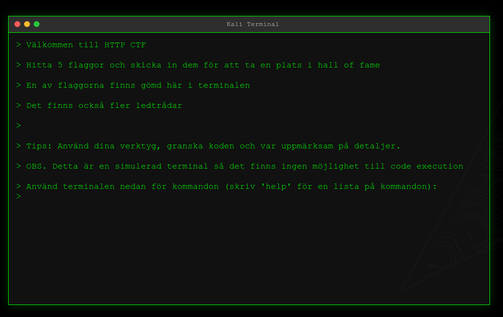

# HTTP Advanced – En lite svårare HTTP CTF

**HTTP Advanced** är en lite svårare CTF där du utvecklar dina kunskaper inom HTTP, cookies osv. Du kommer att behöva använda webbläsarens utvecklingsverktyg, `curl`, eller verktyg som **Burp Suite** eller **Caido** för att lösa utmaningarna. Även dirbuster, gobuster eller liknande verktyg kan vara användbart (men behövs inte)

Fem flaggor finns gömda i applikationen. Varje flagga skickas in via ett formulär i frontend.



---

## Docker

```bash
git clone https://github.com/ditt-användarnamn/http-advanced.git
cd http-advanced
```

```bash
docker build -t http-advanced .
docker run -p 4000:4000 http-advanced
```

## 🛠 Installation

För att köra applikationen lokalt behöver du **Node.js** installerat.
Om du ska exponera webbservern, tänk på att den innehåller flertalet sårbarheter.

### 1. Klona repot

```bash
git clone https://github.com/ditt-användarnamn/http-advanced.git
cd http-advanced
```

### 2. Installera beroenden

```bash
npm install
```

### 3. Starta servern

```bash
node server
```

Servern körs på <http://localhost:4000>
(Ändra port variabeln för att välja en annan port)

Skapad av: Björn Ettelman
